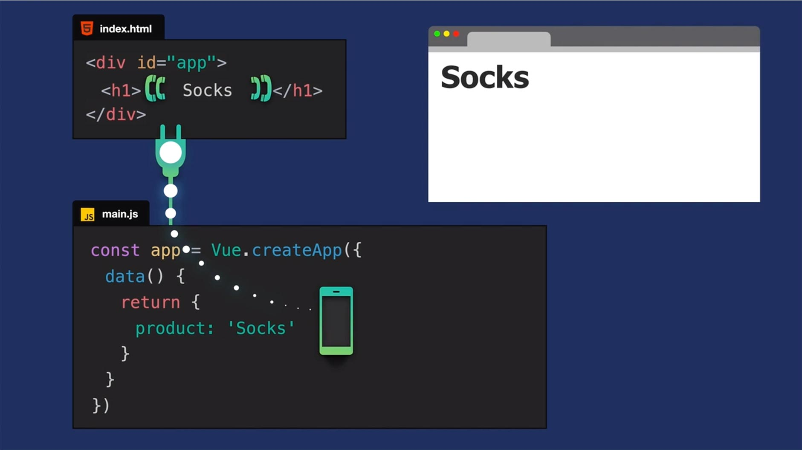

## 

# Resources
- [Vue js offcial docs](https://vuejs.org/guide/quick-start.html#creating-a-vue-application)
- [Good starter to learn vue using CDN by Vue Mastery](https://www.vuemastery.com/courses/intro-to-vue-3/creating-the-vue-app-vue3)
- [Vue.js Crash Course by Traversy Media](https://youtu.be/VeNfHj6MhgA?si=L61e8AdLv9SDfdMA)

## What is Vue js?

[Vue js](https://vuejs.org/) is created by [Evan You](https://evanyou.me/) and it's:

- Progressive JS Framework for building user interfaces & [SPAs](https://youtu.be/eIxDHgzGCnY?si=8BF4vpzHfxpNHovR)
- Designes to be simple, flexible and incrementally adoptable.
- Used for projects in all sizes.
- Reactive data-binding & component-based architecture.

## Vue js project struture

### _Vue Components_

with any other js framework vue js is built around the concept of components (reusable pieces of code) that are broken into three parts essentially:

- <u>_The logic_</u> which is the javascript (state, data, event, imports, ...).
- <u>_The template output_</u> consists of html that will be rendred, we can include dynamique elements (variables, loops, conditionals) using directives.
- <u>The style</u> which is the CSS and we can add scoped to make the style pertain to a specifi component.

### Getting started with vue.js

there are man ways to reate a vue js project like [using CDN](https://vuejs.org/guide/quick-start.html#using-vue-from-cdn) (Content Delivery Network) then we use `createApp() method` or [using create-vue](https://vuejs.org/guide/quick-start.html#creating-a-vue-application) `npm create vue@latest`.

#### Using CDN method
In this case, we should use the script tag:  
``
 we can plug in our vue app in in a piece of our DOM as shown bellow:
<figure>
  
  <figcaption>Figure 1: picture from vuemastery intro-to-vue-3 course.</figcaption>
</figure>

#### Using create-vue
