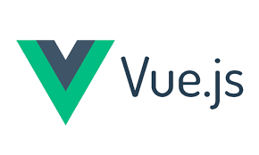
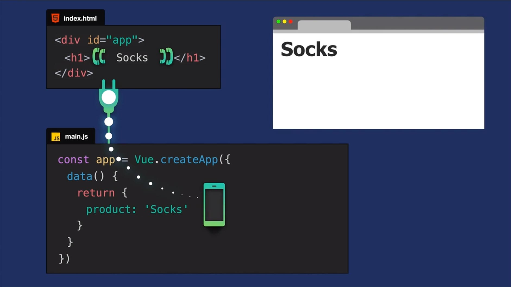
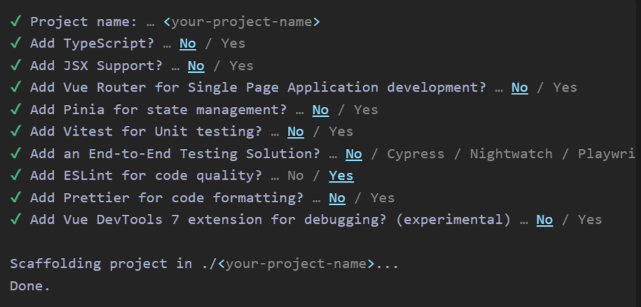

## 

# Resources

- [Vue js offcial docs](https://vuejs.org/guide/quick-start.html#creating-a-vue-application)
- [Good starter to learn vue using CDN by Vue Mastery](https://www.vuemastery.com/courses/intro-to-vue-3/creating-the-vue-app-vue3)
- [Vue.js Crash Course by Traversy Media](https://youtu.be/VeNfHj6MhgA?si=L61e8AdLv9SDfdMA)

## What is Vue js?

[Vue js](https://vuejs.org/) is created by [Evan You](https://evanyou.me/) and it's:

- Progressive JS Framework for building user interfaces & [SPAs](https://youtu.be/eIxDHgzGCnY?si=8BF4vpzHfxpNHovR)
- Designes to be simple, flexible and incrementally adoptable.
- Used for projects in all sizes.
- Reactive data-binding & component-based architecture.

## Vue js project struture

### _Vue Components_

with any other js framework vue js is built around the concept of components (<span style="color:green">reusable pieces of code</span>) that are broken into three parts essentially:

- <u>_The logic_</u> which is the javascript (state, data, event, imports, ...).
- <u>_The template output_</u> consists of html that will be rendred, we can include dynamique elements (variables, loops, conditionals) using <span style="color:lightblue">directives</span>.
- <u>The style</u> which is the CSS and we can add scoped to make the style pertain to a specifi component.

### Getting started with vue.js

there are man ways to reate a vue js project like [using CDN](https://vuejs.org/guide/quick-start.html#using-vue-from-cdn) (Content Delivery Network) then we use `createApp() method` or [using create-vue](https://vuejs.org/guide/quick-start.html#creating-a-vue-application) `npm create vue@latest`.

#### Using CDN method

In this case, we should use the script tag:

```js
<script src="https://unpkg.com/vue@3/dist/vue.global.js"></script>
```

then we can plug in our vue app in in a piece of our DOM as shown bellow:

<figure>
  
  <figcaption>Figure 1</b>: picture from vuemastery intro-to-vue-3 course.</figcaption>
</figure>

#### Using create-vue

In this case we run the following command in our command line:

```bash
npm create vue@latest
```

This command will install and execute create-vue, the official Vue project scaffolding tool.
Then we can choose from several features suh as TypeScript and testing support a shown below:

<figure>
  
  <figcaption><b>Figure 2</b>: Examples of features prompted in the terminal.</figcaption>
</figure>

---

after [scaffolding](https://vuejs.org/guide/quick-start#creating-a-vue-application) we will have a build setup based on [Vite](https://vite.dev/) ( a tool to manage our app assets hot module replacement) and allow us to use Vue [Single-File Components](https://vuejs.org/guide/scaling-up/sfc.html) (SFCs) which encapsulates the **template**, **logic**, and **styling** of a Vue component in a single file

#### 📦 Why We Pass an Object with CDN and a Component with create-vue

| Setup          | What You Pass to `createApp()` | Why                          |
| -------------- | ------------------------------ | ---------------------------- |
| **CDN**        | Plain JS object                | No components, no build step |
| **create-vue** | Component (like `App.vue`)     | Modular system with SFCs     |

## Vue directive `v-if`, `v-show` `v-for`,`v-bind`, `v-on`, `v-model`

## **v-if, v-else-if and v-else**

The directive v-if is used to conditionally render a block. The block will only be rendered if the directive's expression returns a truthy value

```html
<p v-if="status === 'active'">User is active!</p>
<p v-else-if="status === 'pending'">User is pending!</p>
<p v-else>User is inactive!</p>
```

## **v-show**​
Another option for conditionally displaying an element is the v-show directive. The usage is largely the same:

```html
<h1 v-show="ok">Hello!</h1>
```
The difference is that an element with v-show will always be rendered and remain in the DOM; v-show only toggles the *display CSS property* of the element.

## **v-for**

We can use the v-for directive to render a list of items based on an array

```html
<ul>
    <li v-for="task in tasks" :key="task">{{task}}</li>
</ul>
```

## **v-bind**

v-bind (or the shorthand :) allows us to bind dynamic values to HTML attributes

```html
<div :class="{ active: isActive, 'text-danger': hasError}">Active</div>
```

The above syntax means the presence of the active class will be determined by the truthiness of the data property isActive.

## Listening to Events​

### **v-on**

We can use the `v-on` directive, which we typically shorten to the `@ symbol`, to listen to DOM events and run some JavaScript when they're triggered

```html
<button @click="counter++">Add 1</button>
<p>The button above has been clicked {{ counter }} times.</p>
```

## Form Input Binding
### **v-model**
When dealing with forms on the frontend, we often need to sync the state of form input elements with corresponding state in JavaScript.

 The v-model directive helps us simplify this
 ```html
 <input v-model="text">
 ```

➡️ Learn more about Vue.js directives  in [Vue js docs](https://vuejs.org/guide/essentials/conditional.html)
